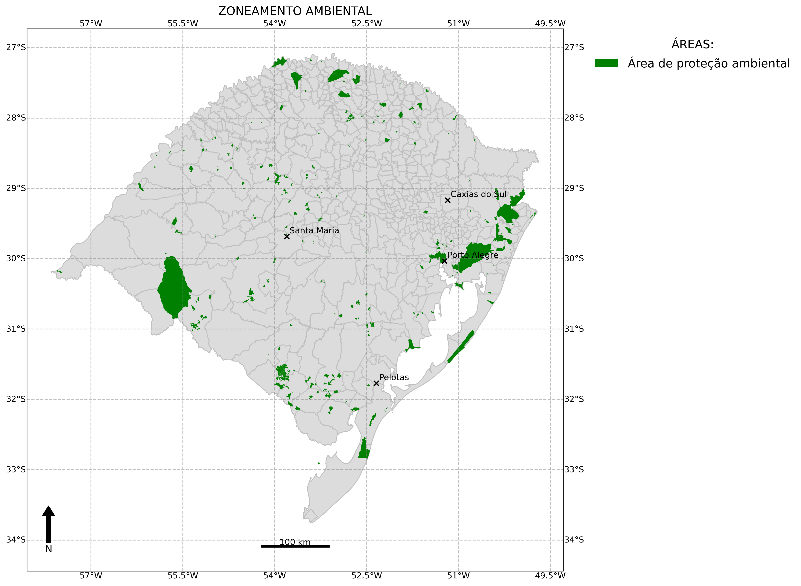
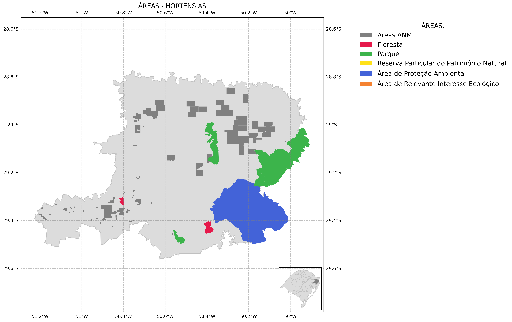
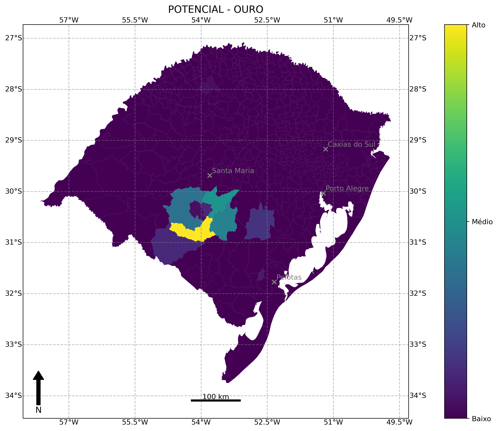

# Mapas-minera-RS

Diagnóstico da mineração no RS em mapas. Todos os mapas foram produzidos usando biblioteca GeoPandas.

# CEFEM

# Ambiental

# Por COREDE

# CEFEM por grupo

# Pontencial

# Operação

## Referências

Todos mapas podem ser visualizados de forma amigável em: https://sema-rs.000webhostapp.com/minera-rs/index.html
