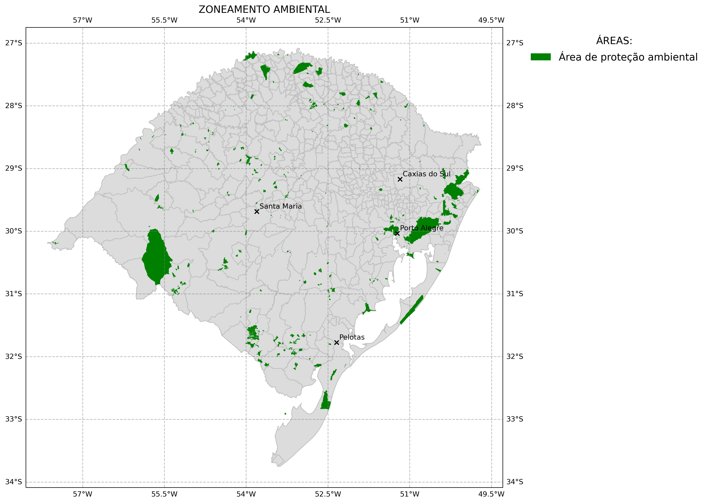
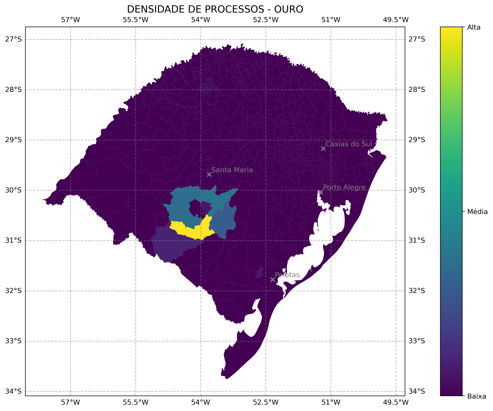

# Mapas-minera-RS

Diagnóstico da mineração no RS em mapas. Todos os mapas foram produzidosusando biblioteca GeoPandas.

# CEFEM

# Ambiental

# Por COREDE

# CEFEM por grupo

# Pontencial

# Operação

